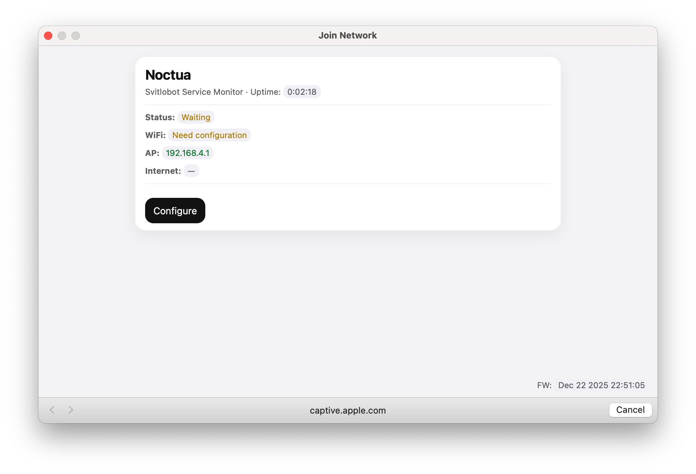

# Noctua

Firmware for ESP8266 boards with a built-in web portal.

License: GPL-3.0-or-later (see LICENSE).

- Language: English / Ukrainian (compile-time selection)
- Boards: ESP-01 (1MB) and Wemos D1 mini
- Build system: PlatformIO

## Web installer

A simple WebSerial installer is available via GitHub Pages:

- https://opylypenko.github.io/Noctua/

It works in Chrome/Edge over HTTPS.

## First run (Wi‑Fi setup)

On first boot, the device starts an AP named **Noctua** and exposes the portal at:

- http://192.168.4.1/

Steps:

1. Connect to the Wi‑Fi network **Noctua**.
2. Open `http://192.168.4.1/` (on macOS/iOS it may open automatically in a captive portal window).
3. Click **Configure** and fill in settings (Wi‑Fi SSID/password, `Channel key`, optional admin password).
4. Click **Save** — the device saves config and switches to STA mode.




## Firmware update (OTA)

The web portal supports OTA firmware updates via the **Firmware update** button in **Configure**.

## Build

```bash
pio run -e noctua -e noctua_ua -e d1_mini -e d1_mini_ua
```

## Upload

Example (adjust the port):

```bash
pio run -t upload -e d1_mini --upload-port /dev/cu.usbserial-110
```

## Українська версія

See [README.md](README.md).