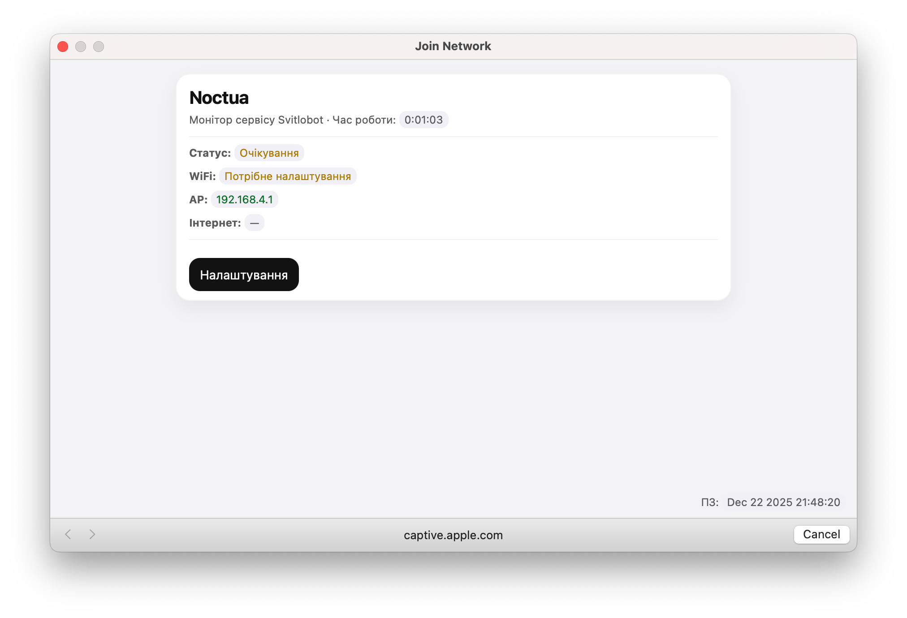
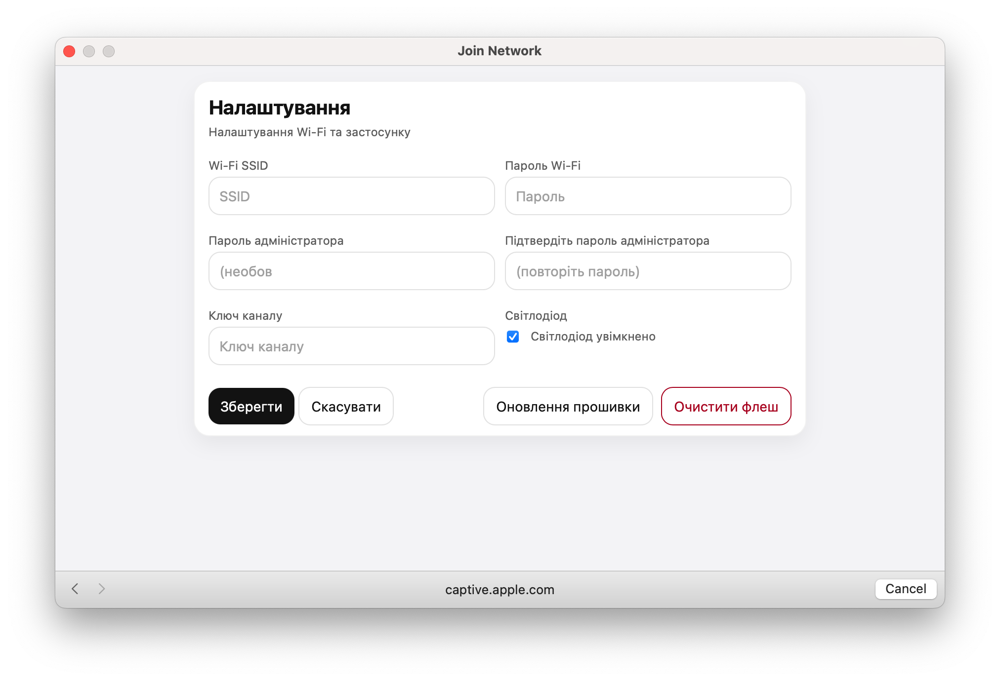

# Noctua

Прошивка для плат ESP8266 з вбудованим веб‑порталом.

Ліцензія: GPL-3.0-or-later (див. LICENSE).

- Мови: англійська / українська (вибір під час компіляції)
- Плати: ESP-01 (1MB) та Wemos D1 mini
- Система збірки: PlatformIO

## Веб‑інсталятор

Простий WebSerial інсталятор (GitHub Pages):

- https://opylypenko.github.io/Noctua/

Працює в Chrome/Edge через HTTPS.

## Перший запуск (налаштування Wi‑Fi)

Після першого запуску пристрій підніме точку доступу **Noctua** і веб‑портал буде доступний за адресою:

- http://192.168.4.1/

Далі:

1. Підключись до Wi‑Fi мережі **Noctua**.
2. Відкрий `http://192.168.4.1/` (на macOS/iOS це може відкритись у вікні captive portal автоматично).
3. Натисни **Configure** і заповни параметри (SSID/пароль Wi‑Fi, `Channel key`, за бажанням admin пароль).
4. Натисни **Save** — пристрій збереже налаштування і переключиться в режим STA.





## Оновлення прошивки (OTA)

У веб‑порталі є оновлення прошивки “по повітрю” (OTA) — кнопка **Firmware update** у розділі **Configure**.

## Збірка

```bash
pio run -e noctua -e noctua_ua -e d1_mini -e d1_mini_ua
```

## Прошивка через USB

Приклад (заміни порт під себе):

```bash
pio run -t upload -e d1_mini --upload-port /dev/cu.usbserial-110
```

## English version

See [README.en.md](README.en.md).
